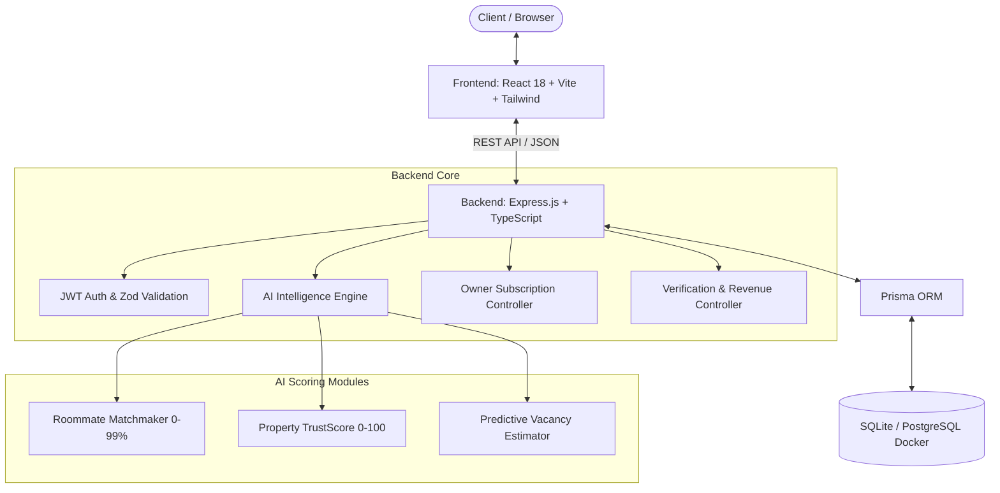

# 🏠 Livora AI — Next-Gen Rental & Roommate Discovery Platform

<div align="center">


[](https://www.typescriptlang.org/)
[](https://react.dev/)
[](https://expressjs.com/)
[](https://www.prisma.io/)
[](https://tailwindcss.com/)
[](https://www.docker.com/)
[](#-monetization--financial-model)

**An intelligent, India-focused property rental & roommate matching platform built with zero brokerage, AI-driven trust scoring, predictive vacancy estimation, and transparent subscription monetization.**

[Quick Start](#-quick-start-guide) • [Key Features](#-key-features) • [Monetization](#-monetization--financial-model) • [Architecture](#-architecture--tech-stack) • [Demo Accounts](#-demo-accounts) • [API Documentation](#-api-endpoints-summary)

</div>

---

## 🌟 Overview

Finding rental accommodation or compatible roommates in Indian metro cities often means paying exorbitant agent brokerages (typically 1–2 months of rent), dealing with unverified listings, and facing incompatible living situations.

**Livora AI** eliminates middlemen and brings complete transparency to the housing market through:
- **₹0 Brokerage**: Renters never pay brokerage fees.
- **2% Flat Renter Platform Fee**: Simple, low-cost fee charged only upon confirmed booking.
- **AI Compatibility Matchmaking**: Multi-parameter roommate scoring based on lifestyle, budget, schedule, cleanliness, and food preferences.
- **Dynamic Property TrustScore (0–100)**: Algorithmic verification rating considering document checks, review accuracy, and owner credentials.
- **Predictive Vacancy Engine**: Data-backed occupancy duration and availability forecasting for property owners.
- **Tiered Owner Subscriptions**: Flexible ₹99 (Basic) & ₹199 (Pro) monthly plans with a 7-day free trial.

---

## ✨ Key Features

### 🔍 For Renters
* **Smart City & Locality Search**: Instant filtering across major Indian hubs (Mumbai, Bengaluru, Delhi NCR, Pune, Hyderabad, etc.).
* **Multi-Filter Discovery**: Filter by Property Type (PG, Flat, Co-Living, Hostel), Rent range, AC, Food Availability, Power Backup, and Verification status.
* **AI Roommate Compatibility Index**: Match with potential flatmates with detailed breakdown (Sleep Schedule, Cleanliness, Budget, Social traits, Food preferences, Hobbies).
* **Side-by-Side Property Comparison**: Compare pricing, deposit, amenities, TrustScore, and vacancy timelines simultaneously.
* **Transparent Pre-Booking Modal**: Instant breakdown of Rent, Deposit, 2% Platform Fee, and **₹0 Brokerage** before confirming.
* **Property TrustScore Badge**: Visual **✓ Livora Verified** badge for admin-verified listings.

### 🏢 For Property Owners
* **Property & Room Management**: Easily list properties, add individual rooms, set sharing types, and update bed availability.
* **Automated 7-Day Free Trial**: Instant trial activation upon owner registration (Up to 2 active properties).
* **Tiered Subscription Access**:
  * **Basic Plan (₹99/mo)**: List up to 2 properties with full booking & room management.
  * **Pro Plan (₹199/mo)**: List up to 10 properties with **Featured Listing Boosts** and priority discovery.
* **Occupancy & Revenue Analytics**: Real-time occupancy rate trends, active bookings count, and monthly revenue tracking.
* **Predictive Vacancy Insights**: AI-assisted predictions on estimated vacancy days and confidence metrics.

### 🛡️ For System Administrators
* **Verification Pipeline**: Review pending owner verification requests, inspect uploaded identity documents, and approve or reject listings.
* **Live Revenue Dashboard**: Real-time monitoring of total platform earnings split between **Owner Subscriptions** and **Renter Platform Fees (2%)**.

---

## 📐 Architecture & Tech Stack



### Stack Components

| Layer | Technologies Used |
|---|---|
| **Frontend Framework** | [React 18](https://react.dev/), [Vite](https://vitejs.dev/), [TypeScript](https://www.typescriptlang.org/) |
| **Styling & UI** | [Tailwind CSS](https://tailwindcss.com/), [Lucide Icons](https://lucide.dev/), CSS Glassmorphism |
| **Backend API** | [Express.js](https://expressjs.com/), [Node.js](https://nodejs.org/), [Zod](https://zod.dev/) |
| **Database & ORM** | [Prisma ORM](https://www.prisma.io/), SQLite (Dev) / PostgreSQL (Prod Container) |
| **Authentication** | JSON Web Tokens (JWT), Bcrypt password hashing |
| **Containerization** | [Docker](https://www.docker.com/) & Docker Compose |

---

## 💰 Monetization & Financial Model

Livora AI employs a two-sided transparent revenue model:

```
                  ┌──────────────────────────────────────────────┐
                  │              LIVORA AI PLATFORM              │
                  └──────┬───────────────────────────────┬───────┘
                         │                               │
                         ▼                               ▼
            ┌────────────────────────┐      ┌────────────────────────┐
            │   RENTER MONETIZATION  │      │   OWNER MONETIZATION   │
            ├────────────────────────┤      ├────────────────────────┤
            │  Brokerage: ₹0         │      │  7-Day Free Trial      │
            │  Platform Fee: 2%      │      │  Basic Plan: ₹99/mo    │
            │  (Of Monthly Rent)     │      │  Pro Plan: ₹199/mo     │
            └────────────────────────┘      └────────────────────────┘
```

### 1. Renter Side (2% Platform Fee & ₹0 Brokerage)
* **Brokerage Fee**: Guaranteed **₹0** across all properties.
* **Platform Fee Calculation**:
  $$\text{Platform Fee} = \text{Math.round}(\text{Monthly Rent} \times 0.02)$$
* **Example Booking Breakdown**:
  * Monthly Rent: ₹15,000
  * Security Deposit: ₹10,000
  * Livora Platform Fee (2%): **₹300**
  * Brokerage Fee: **₹0**
  * **Total Payable at Booking**: **₹25,300**

### 2. Owner Side (Subscription Tiers)

| Feature / Tier | 🎁 Free Trial | ⚡ Basic Plan | 🚀 Pro Plan |
|---|---|---|---|
| **Monthly Price** | **₹0** (7 Days) | **₹99 / month** | **₹199 / month** |
| **Active Property Limit** | Up to 2 | Up to 2 | Up to 10 |
| **Room Management** | ✅ Included | ✅ Included | ✅ Included |
| **TrustScore Calculation** | ✅ Included | ✅ Included | ✅ Included |
| **Vacancy Prediction** | ✅ Included | ✅ Included | ✅ Included |
| **Featured Listing Boost** | ❌ Excluded | ❌ Excluded | ✅ Included (Priority Search Rank) |
| **Analytics Dashboard** | Basic | Standard | Advanced |

---

## 🔑 Demo Accounts

The project includes seeded credentials for testing all user roles instantly:

| Role | Email Address | Password | Privileges & Demo State |
|---|---|---|---|
| 👤 **Renter** | `renter@demo.livora.ai` | `Demo@12345` | Preset profile, saved properties, roommate match profile |
| 🏡 **Owner** | `owner@demo.livora.ai` | `Demo@12345` | Active PRO plan, listed properties, occupancy analytics |
| 🛡️ **Admin** | `admin@demo.livora.ai` | `Demo@12345` | Pending verification queue, Live Revenue & system stats |

---

## 🚀 Quick Start Guide

### Prerequisites
- **Node.js**: `v18.0.0` or higher
- **npm**: `v9.0.0` or higher
- **Docker & Docker Compose** *(Optional, for PostgreSQL production mode)*

---

### Step 1: Clone & Installation

```bash
# Clone the repository
git clone https://github.com/your-username/livora-ai.git
cd "livora-ai"
```

---

### Step 2: Backend Setup

```bash
# Navigate to backend folder
cd backend

# Install dependencies
npm install

# Generate Prisma Client & Push Schema
npx prisma generate
npx prisma db push

# Seed synthetic properties, users, and roommate profiles across 15+ Indian cities
npm run seed

# Start development backend
npm run dev
```
> [!NOTE]
> The backend server will start at `http://localhost:5000`. Database file is saved persistently at `backend/data/livora.db`.

---

### Step 3: Frontend Setup

Open a new terminal tab:

```bash
# Navigate to frontend folder
cd frontend

# Install dependencies
npm install

# Start Vite development server
npm run dev
```
> [!TIP]
> The web application will launch at `http://localhost:5173`. You can log in using any of the [Demo Accounts](#-demo-accounts).

---

### Step 4: Docker Setup (Alternative PostgreSQL Mode)

If you prefer running a dedicated PostgreSQL container:

```bash
# From project root
docker-compose up -d
```
This spins up a `postgres:15-alpine` container listening on port `5432` with pre-configured health checks.

---

## 🔌 API Endpoints Summary

### 🔐 Authentication (`/api/auth`)
* `POST /api/auth/register` — Register a new `RENTER` or `OWNER` (auto-issues 7-day trial for owners).
* `POST /api/auth/login` — Authenticate and receive JWT token.
* `GET /api/auth/me` — Fetch current user context & active subscription status.

### 🏡 Properties & Discovery (`/api/properties`)
* `GET /api/properties` — Search listings with filters (`city`, `locality`, `propertyType`, `maxRent`, `ac`, `food`, `powerBackup`, `verified`).
* `GET /api/properties/:id` — Fetch detailed property view, rooms, reviews, and TrustScore.
* `POST /api/properties` — Create listing (*Owner/Admin only; enforces subscription limits*).
* `GET /api/properties/:id/trust-score` — Fetch dynamic 0–100 TrustScore calculation.
* `GET /api/properties/:id/vacancy` — Fetch predictive occupancy and vacancy timeline.

### 🤝 Roommates & Matching (`/api/roommates`)
* `GET /api/roommates/matches` — Compute AI compatibility index against other profiles.
* `GET /api/roommates/profile` — Fetch or update user roommate search preferences.

### 📅 Bookings & Pricing (`/api/bookings`)
* `POST /api/bookings` — Create pre-booking with exact fee calculations (Rent + Deposit + 2% Platform Fee).
* `GET /api/bookings` — List bookings for current renter or owner.

### 💳 Owner Subscriptions (`/api/owner`)
* `GET /api/owner/subscription` — View current plan (`TRIAL`, `BASIC`, `PRO`), status, and property limits.
* `POST /api/owner/subscription/subscribe` — Demo payment endpoint to upgrade to Basic (₹99) or Pro (₹199).
* `GET /api/owner/analytics` — Revenue, occupancy rate, and booking stats.

### 🛡️ Admin & System (`/api/admin`)
* `GET /api/admin/verifications` — View pending verification queue.
* `PATCH /api/admin/properties/:id/verify` — Approve property verification & award **✓ Livora Verified** badge.
* `GET /api/admin/revenue` — Real-time revenue analytics breakdown.
* `GET /health` — System and database health status indicator.

---

## 📁 Directory Structure

```
Livora ai/
├── docker-compose.yml           # PostgreSQL service container definition
├── README.md                    # Project documentation & overview
├── backend/
│   ├── api.ts                   # REST API routes & controllers
│   ├── ai.ts                    # AI TrustScore, Vacancy & Matchmaking algorithms
│   ├── auth.ts                  # JWT Authentication & role middleware
│   ├── database.ts              # Prisma Client initialization
│   ├── seed.ts                  # Database seeder for Indian cities & properties
│   ├── server.ts                # Express server entry point
│   ├── schema.prisma            # Database schema & models
│   ├── package.json             # Backend dependencies & scripts
│   └── tsconfig.json            # Backend TypeScript configuration
└── frontend/
    ├── src/
    │   ├── App.tsx              # Main React application & state manager
    │   ├── main.tsx             # React DOM entry point
    │   ├── index.css            # Tailwind & visual styling system
    │   └── lib/
    │       └── api.ts           # Axios/Fetch API client layer
    ├── package.json             # Frontend dependencies & scripts
    ├── tailwind.config.js       # Tailwind CSS configuration
    └── vite.config.ts           # Vite build configuration
```

---

## 🧪 Health Verification

You can verify the backend status at any time by issuing a GET request:

```bash
curl http://localhost:5000/health
```

Expected Response:
```json
{
  "status": "ok",
  "database": "connected",
  "application": "Livora AI"
}
```

---

## 🤝 Contributing

Contributions are welcome! Follow these steps:
1. Fork the Repository.
2. Create a Feature Branch (`git checkout -b feature/AmazingFeature`).
3. Commit your Changes (`git commit -m 'Add some AmazingFeature'`).
4. Push to the Branch (`git push origin feature/AmazingFeature`).
5. Open a Pull Request.

---

## 📄 License

Distributed under the MIT License. See `LICENSE` for more details.

---

<div align="center">
  <sub>Built with ❤️ for hassle-free, brokerage-free living across India.</sub>
</div>
